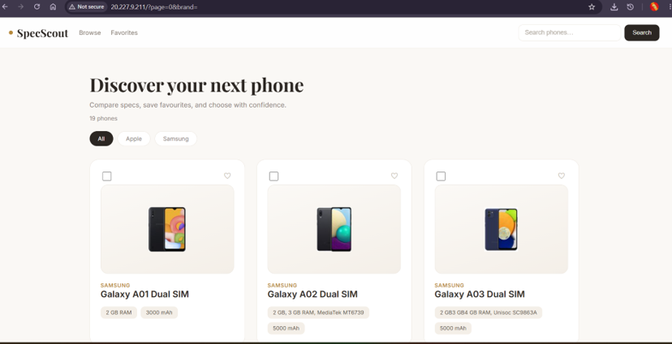
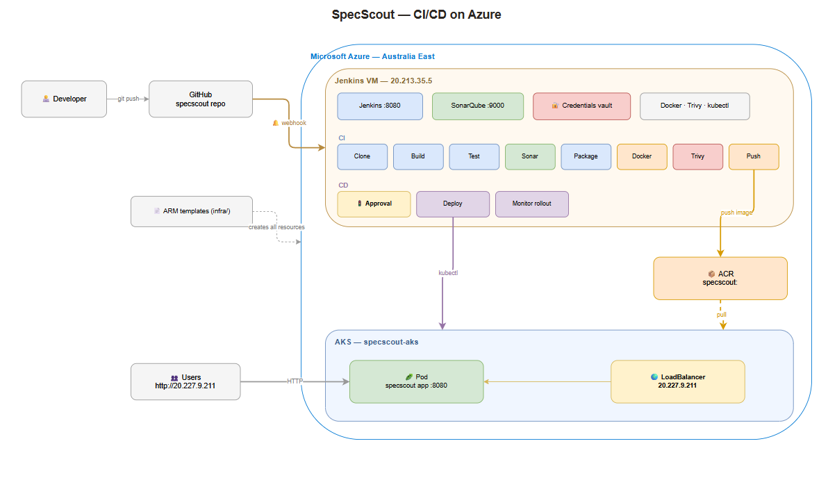
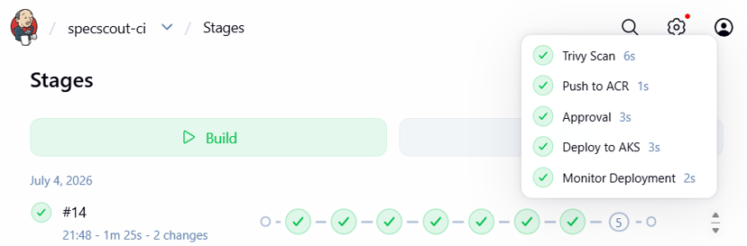

# SpecScout 📱

**A luxury phone discovery & comparison web app — delivered through a fully automated CI/CD pipeline on Microsoft Azure.**

Every `git push` triggers Jenkins to build, test, quality-check, security-scan, containerize and (after a manual approval gate) deploy the app to Azure Kubernetes Service with zero downtime.

---

## ✨ The Application

SpecScout lets users browse, filter, favorite and compare smartphones side-by-side.

- **Backend:** Java 17 · Spring Boot · Spring Data JPA · H2
- **Frontend:** Thymeleaf, light-luxury theme (Playfair Display / Inter, ivory + gold)
- **Features:** brand filter chips · pagination · favorites · phone detail pages · compare up to 3 phones with automatic "Best Overall" detection and smart recommendations when there's no clear winner
- **Self-contained data:** 19 phones (specs + images) are baked into `src/main/resources/phones.tsv`, seeded on startup — the app runs identically on a laptop, in Docker, or in the cloud with **no runtime API dependency**



## 🏗️ Architecture



```
Developer ──git push──▶ GitHub ──webhook──▶ Jenkins VM (Azure, Ubuntu 24.04)
                                              │  Maven build + unit tests
                                              │  SonarQube analysis (quality gate)
                                              │  Docker build  (tag = build #)
                                              │  Trivy vulnerability scan
                                              │  Push image ──────────▶ ACR
                                              │  🚦 Manual approval gate
                                              │  kubectl apply / set image ──▶ AKS
                                              │  Rollout monitoring
                                              ▼
                                   🌍 Public LoadBalancer IP  ◀── users
```

All Azure infrastructure is defined as **ARM templates** in [`infra/`](infra/):

| Template | Creates |
|---|---|
| `acr-template.json` | Azure Container Registry (Basic SKU, admin enabled) |
| `aks-template.json` | AKS cluster — 1× Standard_D2s_v3 node, system-assigned identity, AcrPull access |
| `jenkins-vm-template.json` | Ubuntu VM + static Standard public IP + NSG (22 / 8080 / 9000) + VNet + NIC |

## 🤖 The Pipeline (`Jenkinsfile` — 11 stages)



| # | Stage | What it does |
|---|---|---|
| 1 | **Clone** | Pulls `main` from GitHub (auto-triggered by webhook) |
| 2 | **Build** | `mvnw clean compile` (pinned to JDK 17 via `JAVA_HOME`) |
| 3 | **Test** | Unit tests — API key injected from the **Jenkins credentials vault** |
| 4 | **SonarQube Analysis** | Publishes quality report (Security A · Reliability A · Maintainability A) |
| 5 | **Package** | Builds the executable JAR |
| 6 | **Docker Build** | Two-stage image, tagged `specscout:<BUILD_NUMBER>` |
| 7 | **Trivy Scan** | CVE scan (HIGH/CRITICAL, audit mode) — app layers: **0 vulnerabilities** |
| 8 | **Push to ACR** | Secure `--password-stdin` login, versioned push |
| 9 | **Approval** 🚦 | Pipeline pauses — human clicks *Deploy 🚀* (30-min timeout) |
| 10 | **Deploy to AKS** | `kubectl apply -f k8s/` + rolling image update (zero downtime) |
| 11 | **Monitor Deployment** | `rollout status` gates success; prints deployment/pod/service health |

## 🔐 Security Practices

- Secrets **never** in the repo — `application.properties` is gitignored; an `application.properties.example` template is committed instead
- API key & registry credentials live in the **Jenkins credentials vault**, injected at build time and masked in logs
- AKS pulls images via **managed identity** (AcrPull role) — no registry passwords in the cluster
- Every image is **Trivy-scanned** before it can ship

## 🚀 Run Locally

```bash
# 1. Configure the (optional) API key
cp src/main/resources/application.properties.example src/main/resources/application.properties

# 2. Run
./mvnw spring-boot:run          # → http://localhost:8080

# Or with Docker
docker build -t specscout:local .
docker run -p 8080:8080 specscout:local
```

## 📁 Repository Layout

```
├── src/                  # Spring Boot application (+ phones.tsv seed data)
├── infra/                # ARM templates — ACR, AKS, Jenkins VM (IaC)
├── k8s/                  # Kubernetes manifests — Deployment + LoadBalancer Service
├── Dockerfile            # Two-stage build (Maven/JDK17 → slim JRE)
└── Jenkinsfile           # The 11-stage CI/CD pipeline (pipeline as code)
```

## 🧰 Tech Stack

`Java 17` `Spring Boot` `Maven` `Thymeleaf` `H2` · `Docker` `Jenkins` `SonarQube` `Trivy` · `Azure ARM Templates` `ACR` `AKS / Kubernetes` `GitHub Webhooks`

---

*Built as a hands-on, end-to-end DevOps project — every resource created as code, every release verified, scanned and monitored.*

## Author

**Muhammad Farhan Sohail** — [LinkedIn](https://www.linkedin.com/in/muhammad-farhan-sohail-019a37220/)
